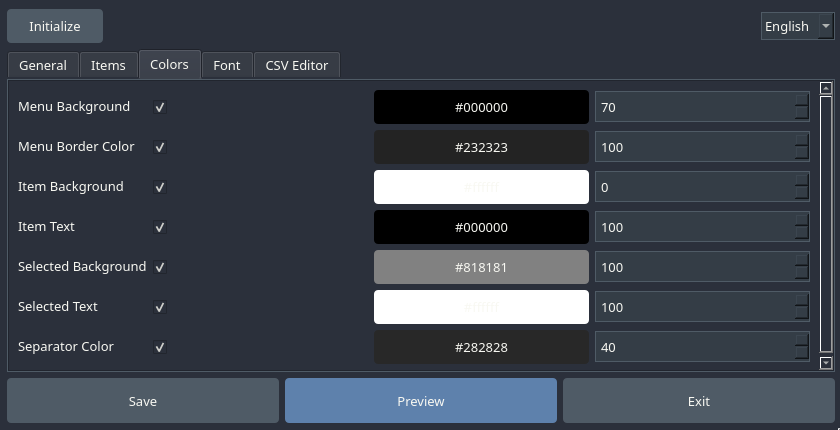

# Qt-JGMenu-GUI-Editor
Qt JGMenu GUI Editor is a small graphical configurator for [[jgmenu]: https://github.com/jgmenu/jgmenu] with menu collision checking written in Python 3 using PyQt6. 

! Attention! The application was tested only on ArchLinux!
But it should work in other distributions as well.

Qt JGMenu GUI Editor — небольшой графический конфигуратор для [[jgmenu]: https://github.com/jgmenu/jgmenu] с проверкой конфликтов в меню, написанный на Python 3 с использованием PyQt6.

!Внимание! Приложение тестировалось только на ArchLinux!
Но должно работать и в других дистрибутивах.

